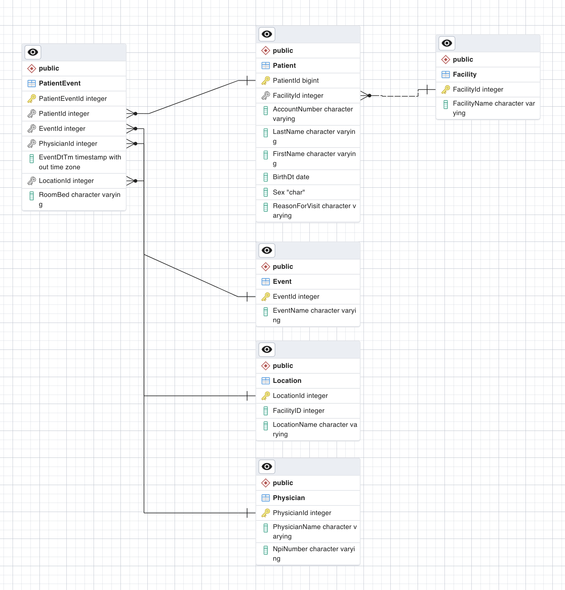
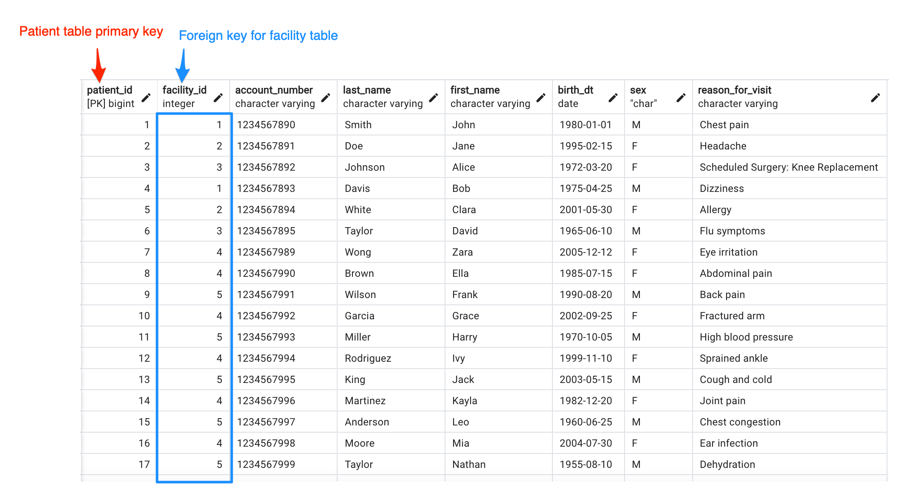
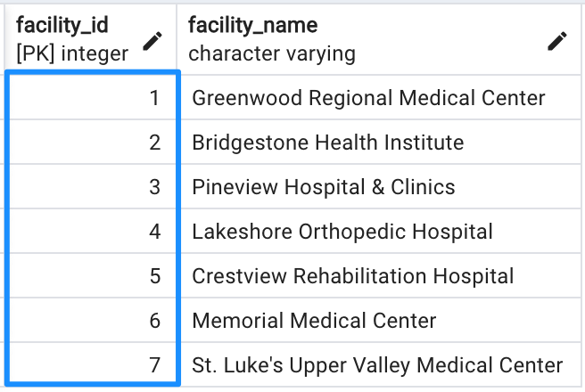
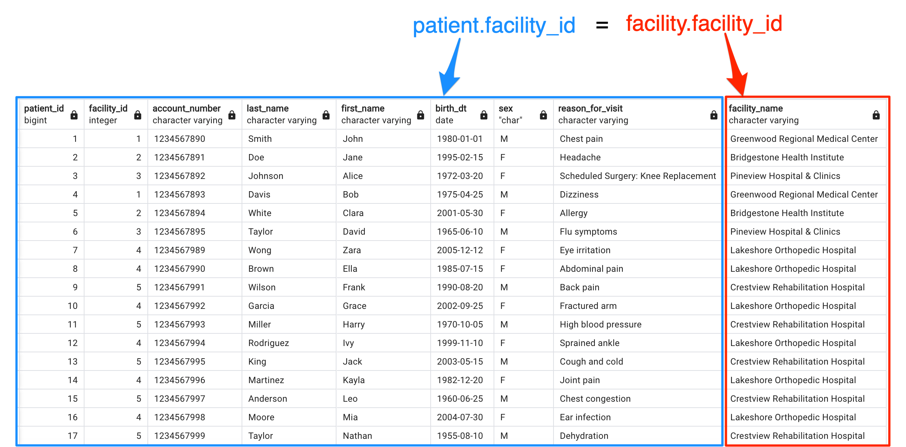

# LEFT Join


> Table structure is critical when trying to setup joins. The primary and foreign keys are the your guide when joining tables to each other. 

__PRIMARY key (PK): UNIQUE identifier for table - GOLD KEY__

__FOREIGN key (FK): FORIEIGN table's PK used to identify unique relationship - SILVER KEY__




```sql
-- primary key (PK): patient_id, unique identifier
-- Foreign key (FK): facility_id, facility table's PK used to identify unique facility

SELECT 
	patient_id
	, facility_id
	, account_number
	, last_name
	, first_name
	, birth_dt
	, sex
	, reason_for_visit
FROM public.patient
LIMIT 17;

```




```sql
-- primary key (PK): facility_id, unique identifier

SELECT
    facility_id
    , facility_name
FROM 
	public.facility;

```



```sql
-- patient table left join facility table, all patient rows and only matching facility rows are returned
-- join using the facility_id key from both patient and facility tables
-- *NOTE always use table aliases in column names to prevent future headaches, not knowing which table each column originated from
SELECT 
	pat.patient_id
	, pat.facility_id
	, pat.account_number
	, pat.last_name
	, pat.first_name
	, pat.birth_dt
	, pat.sex
	, pat.reason_for_visit
	, fac.facility_name
from
	public.patient pat
left join
	public.facility fac
	on pat.facility_id = fac.facility_id
LIMIT 17;
```



> Left Join Animation `6F_left_join_animation.m4v`